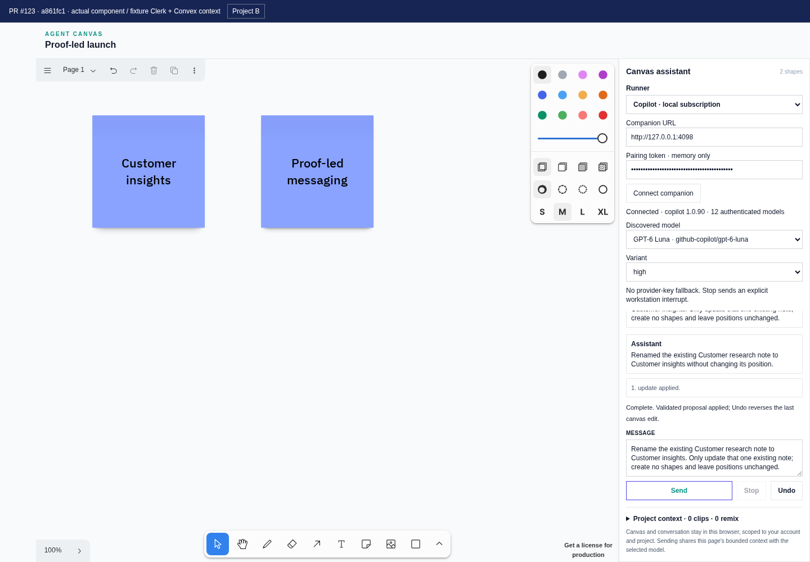
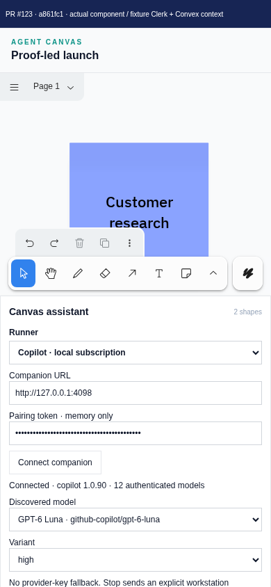
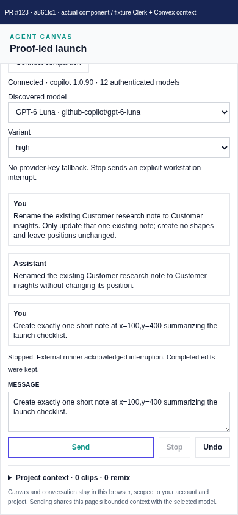

# PR #123 — actual canvas browser evidence

Captured 2026-10-03 in an isolated worktree at **`a861fc1d474781ffe3671b4198bc970bc6f9bb92`**, the published PR head when capture began. Concurrent CI fix `dbc33a554a5940f98d8713b69fd95c9ac05b2024` arrived during capture; evidence was appended after it without rewriting history. Images describe the tested SHA, not a later deployment.

## Real versus fixture

- **Real:** committed AgentCanvas, controller, hook, runner client, proposal validation/executor, tldraw Editor, native Undo, Tailwind/theme/tldraw styles, companion and Copilot adapter. Actual Chromium UI connects to port 4098, discovers 12 authenticated models, selects **github-copilot/gpt-6-luna / high**, and runs real subscription inference. SDK 1.0.16 / runtime 1.0.90; existing GitHub authentication stays in memory.
- **Fixture:** Clerk auth/JWT, Convex queries, project and `/agent-canvas/context`; project-browser sidebar omitted. Visible banner labels fixtures. Approved grounding says customers want a simple launch checklist, starting with customer research and proof-led messaging. Zero selected clips reflects fixture query data; the fixture endpoint supplies grounding. No live deployment/auth claim.
- **Mock provider only for separate tests:** `/agent-canvas/stream` serves deterministic SSE for three existing AI SDK browser tests. Copilot visuals use real model output, not that endpoint.
- Pairing token is masked, memory-only and absent from localStorage. Credentials, pairing files, runner state and raw sessions are excluded.

## Visuals

| File                          | Dimensions / duration          |   Bytes | Caption                                                                                                                              |
| ----------------------------- | ------------------------------ | ------: | ------------------------------------------------------------------------------------------------------------------------------------ |
| desktop-real-copilot.png      | 1440×1000                      |  110452 | Real follow-up renames Customer research to Customer insights; two shapes and update receipt.                                        |
| desktop-native-undo.png       | 1440×1000                      |  110541 | Undo restores Customer research; historical transcript remains.                                                                      |
| desktop-stop-acknowledged.png | 1440×1000                      |  105281 | Real Stop after admission acknowledged; two existing notes kept, third not applied.                                                  |
| mobile-real-copilot-full.png  | 390×844                        |   44667 | Top mobile viewport: canvas above stacked assistant. Native canvas is pannable; second note outside narrow viewport.                 |
| mobile-controls.png           | 390×844                        |   60834 | Same session scrolled: exact model, transcript, Stop status, Message, Send and Undo accessible.                                      |
| real-copilot-flow.gif         | 1280×889 / 28.5 s / 171 frames | 3438212 | Actual recording at 2×: runner/model selection, streamed proposal, two notes, follow-up rename, Undo, real Stop and mobile viewport. |






`verification.json` records real inference assertions: two creates, one update, Undo, acknowledged interrupt, two retained shapes, no persisted token, no horizontal mobile overflow and no page errors. Screenshots visually confirm Undo. Three existing Chromium tests passed separately: streamed edits/follow-up/Undo/single Ctrl+Enter; Stop/late-event rejection/project isolation; mobile controls.

## Reproduce

Use captured SHA with locked app dependencies (`bun install --frozen-lockfile`) and isolated pinned runner tooling from `docs/agent-canvas-runners.md`. This capture reused existing application node_modules via symlink; source was the exact detached SHA. Harness bundles actual source with esbuild and compiles app/globals.css using Tailwind PostCSS. Run from checkout root in separate terminals:

```sh
node docs/evidence/agent-canvas/pr-123/fixture.mjs
node docs/evidence/agent-canvas/pr-123/start-companion.mjs
node docs/evidence/agent-canvas/pr-123/capture.mjs

AGENT_CANVAS_FIXTURE_URL=http://localhost:4323 \
  node_modules/.bin/playwright test e2e/agent-canvas.spec.ts \
  --grep 'streamed canvas edits|Stop ignores|mobile canvas' --workers=1 \
  --output=/tmp/opencode/pr123-browser-results
```

Launcher creates private pairing file and dedicated state under /tmp/opencode; `EVIDENCE_TOOLING` overrides isolated tooling path. It reuses gh auth in memory. Real calls consume subscription allowance; output/timing may vary.

Successful video: `/tmp/opencode/pr123-evidence-video/page@15746abecac9b7e9af6350a67f4d955b.webm` (57.16 s), converted without reconstructed frames:

```sh
ffmpeg -y -i /tmp/opencode/pr123-evidence-video/page@15746abecac9b7e9af6350a67f4d955b.webm \
  -vf 'setpts=PTS/2,fps=6,scale=1280:-1:flags=lanczos,split[s0][s1];[s0]palettegen=max_colors=128[p];[s1][p]paletteuse=dither=bayer:bayer_scale=3' \
  docs/evidence/agent-canvas/pr-123/real-copilot-flow.gif
```

## Limitations

Actual-component integration with fixture application auth/data, not authenticated Next.js deployment. Live Convex source resolution/Clerk authorization, AI SDK provider inference, authenticated OpenCode and hosted-browser loopback policy were not verified here. Mobile is Chromium viewport emulation, not physical phone. Preview tools were attempted but screenshot automation failed; Playwright captured actual browser. Initial discarded harness run had unstable fixture arrays causing re-renders; successful run uses stable fixtures and has no page errors. Application code was not changed.
